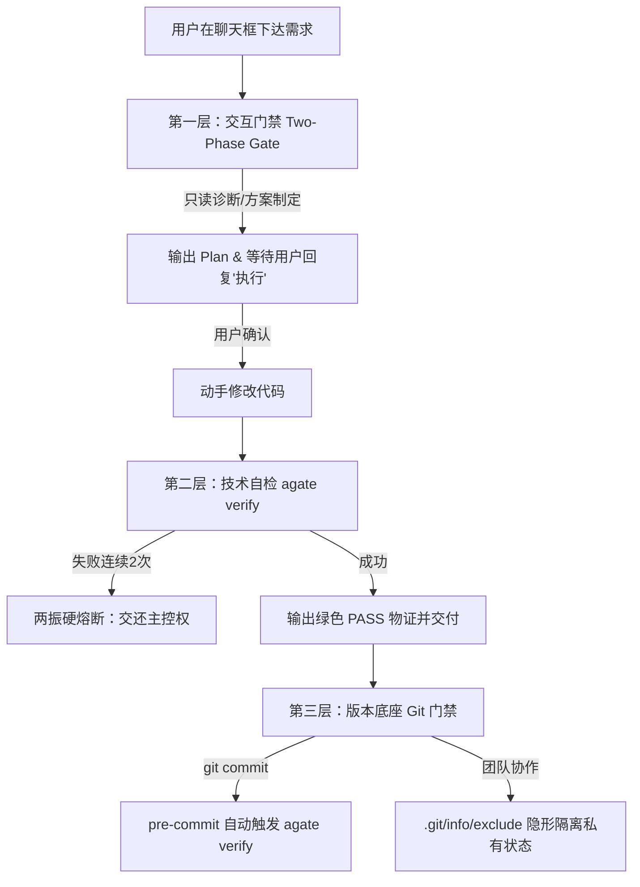

# Agate (Agent Gate)

> 一个专门给 AI 编程助手立规矩、防污染的轻量级命令行工程护栏。

[](https://golang.org)
[](LICENSE)
[](#跨平台兼容)

---

## 📖 为什么做这个工具？

平时用 Cursor、Antigravity、Claude Code 或 Windsurf 写代码，大家基本都会踩这几个坑：

1. **规则到处复制，维护成本高**：每个工具各认各的文件（`.cursorrules`、`.gemini/GEMINI.md`、`CLAUDE.md`）。换个环境就得重新教一遍，改了一处别的工具又忘了同步。
2. **私有状态污染团队 Git**：AI 生成的思考缓存、临时任务单（`TASK.md`）和记忆文件，经常不小心就被 `git add .` 打包提交了，把公共提交历史搞得很乱。
3. **盲目动手与无效死循环**：需求还没摸清，AI 就直接覆写业务代码；跑崩了又在那里胡乱试错，甚至把没跑过编译的代码直接交付给你。

**`agate`（Agent Gate / 玛瑙）** 就是为了解决这些麻烦写的。它是一个零依赖的单文件 Go 程序，用来充当工程护栏：**同一套规约自动分发、AI 私有文件在本地悄悄屏蔽、代码改动前强制出方案、改动后必须跑通自检才准交付。**


---

## ⚡ 核心能力矩阵

| 模块 | 核心功能 | 解决痛点 | 运作机制 |
| :--- | :--- | :--- | :--- |
| **`agate init`** | 一键工程护栏挂载 | 消除多工具配置分裂 | 自动分发核心规约至各 Agent 目标目录，初始化架构地图 `AGENTS.md` 骨架，挂载本地防爆仓与 Git 门禁。 |
| **`agate isolate`** | Git 私有隔离治理 | 杜绝团队公共仓库污染 | 基于 `.git/info/exclude` 本地原生机制，隐形屏蔽 AI 私有配置，对团队无感且零侵入。 |
| **`agate verify`** | 闭环自检物证交付 | 杜绝 AI 伪交付与死循环 | 优先调度项目内 `verify.sh`/`verify.cmd`；无自定义脚本时执行完备性扫描，输出 `[PASS]` 物证。 |
| **`agate scan`** | 智能技术拓扑推导 | 自动化丰富地图文档 | 智能扫描项目配置（Maven/npm/Go/Python 与端口），支持 `--write` 自动回填 `AGENTS.md`。 |
| **`agate hook`** | Git 提交硬拦截 | 防止未验证代码入库 | 自动将本地 `pre-commit` 门禁挂接至 `agate verify`，测试失败瞬间终止 `git commit`。 |

---

## 🚀 快速上手

### 1. 安装方式

#### 预编译单二进制（推荐）
直接从 [GitHub Releases](https://github.com/Simon-yyy/Agate/releases) 下载对应操作系统的免安装单二进制文件，放入系统 `PATH` 目录即可开箱即用：
- **Linux / macOS**: 放置于 `/usr/local/bin/agate` 并执行 `chmod +x /usr/local/bin/agate`
- **Windows**: 放置于任一已配置在系统 `PATH` 的目录（例如 `%USERPROFILE%\bin\agate.exe` 或自定义工具箱目录）

#### 源码构建（离线零依赖）
```bash
git clone https://github.com/Simon-yyy/Agate.git
cd Agate
go build -mod=vendor -o agate main.go
```

### 2. 在新工程中使用

进入任意代码仓库根目录，执行初始化：

```bash
# 1. 初始化护栏（默认智能探测既有环境，或挂载主流 Agent）
agate init

# 提示：若仅使用特定工具，可按需精准挂载（纯净无多余文件）：
# agate init -t cursor      # 仅针对 Cursor
# agate init -t claude      # 仅针对 Claude Code
# agate init -t all         # 全量挂载所有工具

# 2. 检查当前工程健康度与仓库纯净度（闭环验证）
agate verify
```

执行 `agate init -t cursor`（或智能探测）后，终端输出清晰指引：
```text
[agate] 正在为工程 [my-project] 挂载防护体系...
  [+] 已生成 .ignore (索引防爆仓)
  [+] 已向 .git/info/exclude 注入 13 项隔离清单 (私有配置完全隐形)
  [+] 已挂载 cursor 规约 -> .cursorrules
  [+] 已生成 AGENTS.md 骨架
  [+] 已生成 contexts/context.md 基线
  [+] 已挂载私有 pre-commit 门禁 -> agate verify
=== [完成] 工程护栏挂载完毕 ===
💡 后续协同建议：
  1. 规约已在本地注入生效，在此项目中与 AI 对话将默认遵守“方案对齐 + 闭环自检”安全门禁；
  2. (可选冷启动) 如需为 AI 注入全局架构认知，可向 AI 发送：
     “阅读 AGENTS.md 骨架，结合当前代码目录，简要补齐各模块核心职责与关键入口。”
```

---

## 🛡️ 三层防护机制



1. **交互门禁（先对齐方案，再动代码）**：除非是只读排查，否则 AI 必须先给出方案和影响文件清单，等你确认“执行”后才能动手改代码。
2. **自检物证（拿结果交差，两振熔断）**：改完代码后必须在后台跑一遍自检，拿到绿色的 `[PASS]` 退出码才算交付；同一问题修复两次未果强制停手，交还主控权，拒绝无效死循环。
3. **Git 隐形隔离（本地静默屏蔽，提交强卡口）**：把 AI 相关的各种私有配置统一写入本地 `.git/info/exclude`，不碰团队共享的 `.gitignore`；同时在 `pre-commit` 挂上自检，未验证的代码直接被拦在门外。


---

## 🗺️ 架构资产（3-Hop 寻路）

`agate` 提倡跨 Agent 共享的架构认知资产：
- **`AGENTS.md`**：模块拓扑与服务端口矩阵，帮助 AI 快速建立全景空间认知；
- **`contexts/context.md`**：工程技术契约与核心规则基线；
- **`3-Hop 寻路协议`**：AI 检索代码必须遵循：`AGENTS.md -> contexts/context.md -> 目标模块源码`，严禁全仓盲目扫描引发上下文爆仓。

---

## 💻 跨平台设计与兼容性

- **零外部运行时**：基于 Go 标准库编译，无 Node.js、Python、Bash 解释器依赖；
- **符号链接优雅降级**：在 Windows 非开发者模式下（无软链权限）自动回退为物理拷贝，抹平跨操作系统差异；
- **编码与换行符安全**：原生处理 `CRLF/LF`，避免 Shell 脚本在跨平台执行时出现 `\r: command not found`。

---

## 📚 详细文档

- [系统架构与技术设计白皮书 (docs/DESIGN.md)](docs/DESIGN.md)
- [协议与规范标准手册 (docs/SPEC.md)](docs/SPEC.md)

---

## 📄 开源许可证

本项目基于 [MIT 许可证](LICENSE) 发布。
