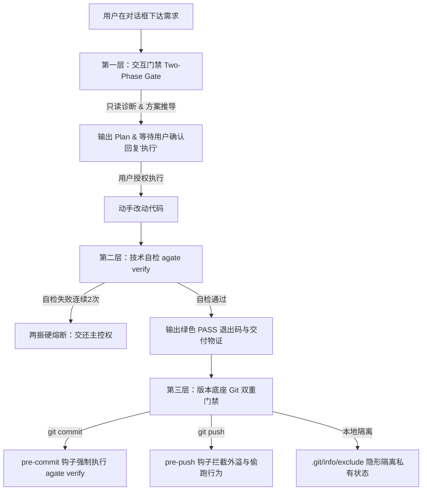

# Agate (Agent Gate)

> 一个专门给 AI 编程助手立规矩、防污染的轻量级命令行工程护栏与安全闸门。

[](https://golang.org)
[](https://github.com/Simon-yyy/Agate/releases)
[](https://github.com/Simon-yyy/Agate/actions/workflows/release.yml)
[](LICENSE)
[](#-跨平台兼容设计)

---

## 📖 为什么需要 Agate？

在日常使用 Cursor、Antigravity (Gemini)、Claude Code 或 Windsurf 等 AI 辅助编程时，开发者常陷入以下三大工程困境：

1. **规约生态分裂与漂移**：每个 AI 工具各自维护私有配置文件（如 `.cursorrules`、`.gemini/GEMINI.md`、`CLAUDE.md`、`.windsurfrules`）。团队换工具或多人协作时必须重复教导，配置分散且容易各处漂移。
2. **私有状态污染团队 Git**：AI 生成的思考缓存、临时任务清单（`TASK.md`）、记忆文件以及编辑器私有配置，极易被 `git add .` 误提交入库，弄脏公共提交树；直接改团队 `.gitignore` 又会产生强侵入性。
3. **盲目动手与无效死循环**：需求未经对齐，AI 就直接大面积覆写业务代码；修改报错后又盲目乱试、陷入死循环试错，甚至将无法通过编译或缺少测试的半成品直接交付给开发者。

**`agate`（Agent Gate / 玛瑙）** 应运而生。它是一个**零外部运行时依赖的单文件 Go 原生程序**，充当团队协作中的安全工程护栏：
- **单一事实源分发**：一套核心规范自动映射至各大 Agent 工具；
- **隐形隔离治理**：基于 Git 本地机制原生屏蔽 AI 私有资产，对团队公共仓库零污染、无感知；
- **三层严密门禁**：动代码前强制出方案对齐，修改后必须跑通自检并产出物证，连续两次未通过强制熔断；
- **双地图架构认知**：为 AI 提供高信噪比的全局空间认知（`AGENTS.md` + `contexts/context.md`），杜绝全仓盲扫引发上下文爆仓。

---

## ⚡ 核心能力矩阵

| 命令 / 模块 | 核心功能 | 解决痛点 | 运作机制 |
| :--- | :--- | :--- | :--- |
| **`agate init`** | 一键工程护栏挂载 | 消除配置分裂，规范项目基线 | 自动分发核心规约至各 Agent，初始化双地图骨架（`AGENTS.md` + `contexts/context.md`），挂载防爆仓索引与本地 Git 双重门禁。 |
| **`agate isolate`** | Git 私有隔离治理 | 杜绝 AI 私有状态污染团队仓库 | 基于原生 `.git/info/exclude` 隐形屏蔽 13+ 项 AI 缓存、草稿与私有配置，不修改公共 `.gitignore`，团队零感知。 |
| **`agate verify`** | 闭环自检物证交付 | 杜绝伪交付与无效死循环试错 | **阶段 0** 静态扫描（拦截密钥、大文件、未完工占位符等 7 大红线）+ **阶段 1** 优先调度项目自检脚本或智能单测套件，输出绿色 `[PASS]` 物证；两振未过强制熔断。 |
| **`agate scan`** | 智能拓扑嗅探推导 | 自动化补齐项目架构全景 | 智能分析工程构建文件（Maven / npm / Go / Python 等）与核心端口拓扑，支持 `--write` 一键自动回填双地图。 |
| **`agate hook`** | Git 双重物理门禁 | 拦截未验证代码与越权外溢 | 挂载本地 `pre-commit`（强制自检验证）与 `pre-push`（防偷跑硬阻断），彻底守住版本控制底线。 |

---

## 🚀 快速安装

### 方式 1：下载官方预编译二进制（推荐）

前往 [GitHub Releases](https://github.com/Simon-yyy/Agate/releases) 下载最新发行版免安装包，解压后将单文件放入系统 `PATH` 路径即可：

| 平台与架构 | 安装包文件名示例 | 推荐安装路径 |
| :--- | :--- | :--- |
| **Linux (x86_64)** | `agate-v*-linux-amd64.tar.gz` | `/usr/local/bin/agate` |
| **macOS (Intel)** | `agate-v*-darwin-amd64.tar.gz` | `/usr/local/bin/agate` |
| **macOS (Apple Silicon)** | `agate-v*-darwin-arm64.tar.gz` | `/usr/local/bin/agate` |
| **Windows (x64)** | `agate-v*-windows-amd64.zip` | `%USERPROFILE%\bin\agate.exe` 或任意系统 PATH 目录 |

**Linux / macOS 快速部署示例：**
```bash
# 解压并移至系统命令目录
sudo tar -zxvf agate-v*-linux-amd64.tar.gz -C /usr/local/bin/
sudo chmod +x /usr/local/bin/agate

# 验证安装
agate --version
```

### 方式 2：源码本地构建（离线零依赖）

若本地已配置 Go 1.21+ 环境，可直接从源码秒级静态编译：

```bash
git clone https://github.com/Simon-yyy/Agate.git
cd Agate
go build -mod=vendor -o agate main.go
```

---

## 💡 使用指南

### 1. 为新工程挂载护栏

在任意代码工程根目录下执行初始化：

```bash
# 智能探测已有开发环境并挂载对应护栏
agate init

# 或按需为特定 Agent 定向挂载（支持组合）：
agate init -t cursor          # 仅生成 .cursorrules
agate init -t gemini          # 仅针对 Antigravity (.gemini/GEMINI.md)
agate init -t claude          # 仅针对 Claude Code (CLAUDE.md)
agate init -t windsurf        # 仅针对 Windsurf (.windsurfrules)
agate init -t all             # 全量挂载所有支持的 Agent 工具
```

执行初始化后，项目即刻具备完整的防护体系：
```text
[agate] 正在为工程 [my-project] 挂载防护体系...
  [+] 已生成 .ignore (索引防爆仓)
  [+] 已向 .git/info/exclude 注入 13 项隔离清单 (私有配置完全隐形)
  [+] 已挂载 cursor 规约 -> .cursorrules
  [+] 已生成 AGENTS.md 骨架
  [+] 已生成 contexts/context.md (技术契约骨架)
  [+] 已挂载私有 pre-commit 门禁 -> agate verify
  [+] 已挂载私有 pre-push 门禁
=== [完成] 工程护栏挂载完毕 ===
```

### 2. 冷启动快速注入架构认知

挂载完成后，可在与 AI 的首轮对话中发送以下提示词，指导 AI 自动完善架构地图：
> *“阅读 AGENTS.md 与 contexts/context.md 骨架，结合当前代码目录，简要补齐各模块核心职责与关键入口。”*

### 3. 闭环自检与交付验证

在 AI 修改代码完毕或提交前，执行自检：

```bash
# 触发两阶段自检（静态安全审计 + 业务单测/验证脚本调度）
agate verify
```
自检通过将输出 `[PASS]` 结果；如连续两次失败，AI 必须停手熔断交还主控权。

### 4. 架构资产智能同步回填

当工程技术栈或依赖发生演进时，利用静态嗅探器自动丰富双地图：

```bash
# 扫描当前工程技术栈与开放端口
agate scan

# 自动将扫描结果回填同步至 AGENTS.md 与 contexts/context.md
agate scan --write
```

---

## 🛡️ 三层防护机制与协作公理



### 1. 交互硬门禁（先出方案，确认后再动代码）
- 遇业务变更或代码修复，首轮仅输出根因分析、精简方案与拟变动文件清单；
- 显式等待用户回复“执行”后方可在次轮动手改代码，杜绝 AI 盲目破坏业务逻辑。

### 2. 自检物证与两振熔断（凭绿灯交付，拒死循环）
- 修改代码后必须运行 `agate verify`（优先调度项目内置 `verify.sh` 或 `verify.cmd`）；
- 必须拿到 `[PASS]` 退出码方可交付；同一报错修复两次未果立即强制熔断，把控制权还给开发者。

### 3. Git 隐形隔离与外溢物理死锁（私有状态隔离，严守底线）
- **隐形隔离**：AI 私有配置全量注册于本地 `.git/info/exclude`，与团队 `.gitignore` 解耦，互不干扰；
- **显式授权公理 (Explicit Mandate Principle)**：Git 提交推送、Release 发布、环境推流等具外溢效应的动作默认物理死锁，除非用户指令中出现明确指向动词（如“提交代码”、“发布 Release”），严禁 AI 擅作主张私自外溢。

---

## 🗺️ 架构认知资产：3-Hop 寻路协议

`agate` 设立标准化的架构双地图体系，约束 AI 按层次由浅入深检索：

1. **第一跳（全局空间感知）**：[AGENTS.md](AGENTS.md) —— 模块定位、技术栈速览、核心入口与架构拓扑；
2. **第二跳（契约规则约束）**：[contexts/context.md](contexts/context.md) —— 核心业务规则、环境约定、API 契约与安全红线；
3. **第三跳（精准源码检视）**：直接定位目标业务源码进行定向阅读与编辑。

> **严格禁止**：未查阅双地图直接对全仓执行全量盲目扫盘，避免浪费上下文窗口与产生幻觉。

---

## 🛠️ 项目维护与版本自动化发布

本项目内置面向开发者的全平台一键语义化版本管理工具：

```bash
# 1. 升级版本号并归档构建至 bin/v<version>/{windows,linux,darwin}
./scripts/bump.sh patch             # 补丁号自增 (如 0.1.1 -> 0.1.2)
./scripts/bump.sh minor             # 次版本自增 (如 0.1.2 -> 0.2.0)
./scripts/bump.sh 0.3.0             # 指定具体版本号

# 2. 一键自增并触发 GitHub Actions 云端 Release 自动化构建
./scripts/bump.sh patch --release   # 自增版本、打 tag 并推送至 GitHub
```

- Windows 环境下可对应运行 `.\scripts\bump.ps1 -Bump patch -Release`；
- 推送标签后，GitHub Actions 流水线将并发交叉编译各平台可执行文件并自动创建 GitHub Release 供用户下载。

---

## 💻 跨平台兼容设计

- **纯静态单二进制**：Go 标准库原生编写，无 Node.js、Python、Shell 等多余运行时羁绊；
- **软链接优雅回退**：在 Windows 非开发者模式下（无创建软链接权限时），自动降级为物理拷贝，抹平系统权限差异；
- **跨平台换行符安全**：原生规避 `CRLF/LF` 差异，防止在 Linux/macOS 执行 Shell 钩子时发生 `\r: command not found` 错误。

---

## 📚 详细文档

- 架构设计与推导背景：[系统架构与技术设计白皮书 (docs/DESIGN.md)](docs/DESIGN.md)
- 协议标准与规约正文：[协议与规范标准手册 (docs/SPEC.md)](docs/SPEC.md)

---

## 📄 开源许可证

本项目基于 [MIT 许可证](LICENSE) 发布。
