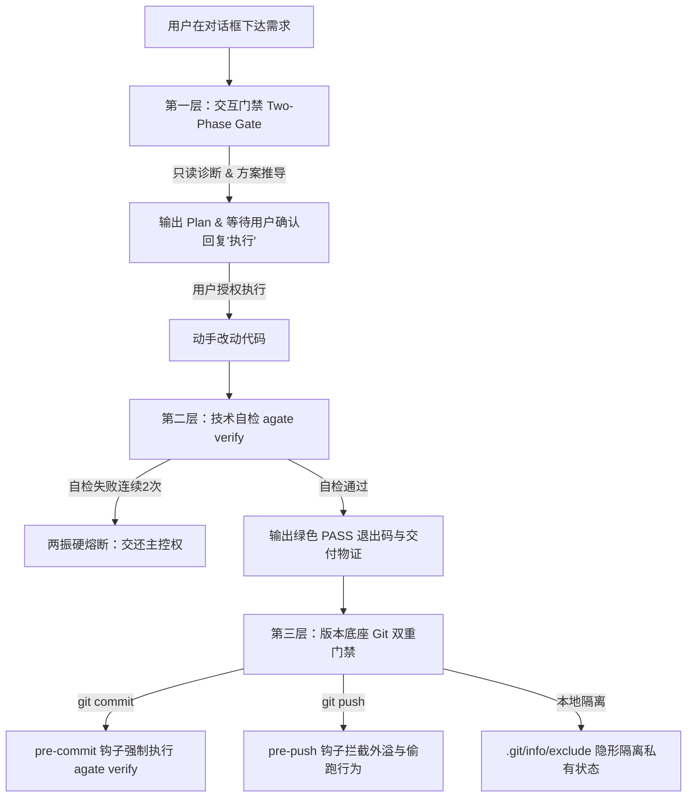

# Agate (Agent Gate)

> 一个专门给 AI 编程助手立规矩、防污染的轻量级命令行工程护栏与安全闸门。

[](https://golang.org)
[](https://github.com/Simon-yyy/Agate/releases)
[](https://github.com/Simon-yyy/Agate/actions/workflows/release.yml)
[](LICENSE)
[](#-跨平台兼容设计)

---

## 📖 为什么需要 Agate？

在日常使用 Cursor、Antigravity (Gemini)、Claude Code 或 Windsurf 等 AI 辅助编程时，开发者常陷入以下三大工程困境：

1. **规约生态分裂与漂移**：每个 AI 工具各自维护私有配置文件（如 `AGENTS.md`、`.cursorrules`、`.gemini/GEMINI.md`、`CLAUDE.md`、`.windsurfrules`）。团队换工具或多人协作时必须重复教导，配置分散且容易各处漂移。
2. **私有状态污染团队 Git**：AI 生成的思考缓存、临时任务清单（`TASK.md`）、记忆文件以及编辑器私有配置，极易被 `git add .` 误提交入库，弄脏公共提交树；直接改团队 `.gitignore` 又会产生强侵入性。
3. **盲目动手与无效死循环**：需求未经对齐，AI 就直接大面积覆写业务代码；修改报错后又盲目乱试、陷入死循环试错，甚至将无法通过编译或缺少测试的半成品直接交付给开发者。

**`agate`（Agent Gate / 玛瑙）** 应运而生。它是一个**零外部运行时依赖的单文件 Go 原生程序**，充当团队协作中的安全工程护栏：
- **单一事实源分发**：一套核心规范自动映射至各大 Agent 工具；
- **隐形隔离治理**：基于 Git 本地机制原生屏蔽 AI 私有资产，对团队公共仓库零污染、无感知；
- **三层严密门禁**：动代码前强制出方案对齐，修改后必须跑通自检并产出物证，连续两次未通过强制熔断；
- **双地图架构认知**：为 AI 提供高信噪比的全局空间认知（`MAP.md` + `contexts/context.md`），杜绝全仓盲扫引发上下文爆仓。

---

## ⚡ 核心能力矩阵

| 命令 / 模块 | 核心功能 | 解决痛点 | 运作机制 |
| :--- | :--- | :--- | :--- |
| **`agate init`** | 一键工程护栏挂载 | 消除配置分裂，规范项目基线 | 自动分发核心规约至各 Agent，初始化双地图骨架（`MAP.md` + `contexts/context.md`），挂载防爆仓索引与本地 Git 双重门禁。 |
| **`agate isolate`** | Git 私有隔离治理 | 杜绝 AI 私有状态污染团队仓库 | 基于原生 `.git/info/exclude` 隐形屏蔽 17 项 AI 缓存、草稿与私有配置（包含 `.env*` 与 `*.agate.bak`），不修改公共 `.gitignore`，团队零感知。 |
| **`agate verify`** | 闭环自检物证交付 | 杜绝伪交付与无效死循环试错 | **阶段 0** 静态扫描（拦截密钥、大文件、未完工占位符等 7 大红线，支持 `--staged` 暂存区定向审查）+ **阶段 1** 优先调度自检脚本或测试套件，输出绿色 `[PASS]` 物证，连续失败触发**两振硬熔断**。 |
| **`agate task`** | 跨 Agent 任务接力 | 跨工具任务脱节、上下文丢失与冲突 | 提供 `status/claim/handover/resume/done` 全流程状态机驱动，支持多 Agent 租约互斥锁、接力四要素结构化传承与交接流转审计时间线。 |
| **`agate export / view`** | HTML 审查物证报告 | 异步代码复盘与人类直观核验 | 将任务看板、Git Diff 对比、安全审计与测试物证一键编译为零网络外链依赖的自包含单文件 HTML 凭单，支持系统默认浏览器秒级预览。 |
| **`agate scan`** | 智能拓扑嗅探推导 | 自动化补齐项目架构全景 | 智能分析工程构建文件（Maven / npm / Go / Python 等）与核心端口拓扑，支持 `--write` 确定性排序稳定回填双地图。 |
| **`agate hook`** | Git 双重物理门禁 | 拦截未验证代码与越权外溢 | 挂载本地 `pre-commit`（暂存区定向自检）与 `pre-push`（白名单授权物理防偷跑），支持 `status` 门禁状态看板。 |
| **`agate ci`** | 远程 CI/CD 自动化门禁 | 杜绝不合格半成品与风险入库 | `agate ci verify` 固定启用严格模式与自包含 HTML 审查物证报告生成，原生适配 GitHub Actions 与 GitLab CI 流水线。 |
| **策略配置** | 项目级声明式规则底座 | 消除配置离散与团队规则漂移 | 识别根目录 `.agate/config.toml`，支持团队统一固化 Agent 规约目标、严格测试开关与 Hook 安装策略，支持命令行动态覆盖。 |

---

## 🚀 快速安装

### 方式 1：下载官方预编译二进制（推荐）

前往 [GitHub Releases](https://github.com/Simon-yyy/Agate/releases) 下载最新发行版免安装包，解压后将单文件放入系统 `PATH` 路径即可：

| 平台与架构 | 安装包文件名示例 | 推荐安装路径 |
| :--- | :--- | :--- |
| **Linux (x86_64)** | `agate_<version>_linux_amd64.tar.gz` | `/usr/local/bin/agate` |
| **macOS (Intel)** | `agate_<version>_darwin_amd64.tar.gz` | `/usr/local/bin/agate` |
| **macOS (Apple Silicon)** | `agate_<version>_darwin_arm64.tar.gz` | `/usr/local/bin/agate` |
| **Windows (x64)** | `agate_<version>_windows_amd64.zip` | `%USERPROFILE%\bin\agate.exe` 或任意系统 PATH 目录 |

**Linux / macOS 快速部署示例：**
```bash
# 解压并移至系统命令目录 (以 linux_amd64 为例)
sudo tar -zxvf agate_*_linux_amd64.tar.gz -C /usr/local/bin/
sudo chmod +x /usr/local/bin/agate

# 验证安装
agate --version
```

### 方式 2：通过 Go 命令一键安装

若本地已安装 Go 1.21+ 环境，可直接通过 `go install` 安装最新版本：

```bash
go install github.com/Simon-yyy/Agate@latest
```

> **提示**：请确保 Go 的二进制安装目录（`$GOPATH/bin` 或 `$HOME/go/bin`）已加入系统的环境变量 `PATH` 中。

### 方式 3：源码本地构建（离线零依赖）

若需在离线或受限环境进行构建，可直接拉取源码静态编译：

```bash
git clone https://github.com/Simon-yyy/Agate.git
cd Agate
go build -mod=vendor -o agate main.go
```

---

## 💡 使用指南

### 1. 为新工程挂载护栏

在任意代码工程根目录下执行初始化：

```bash
# 智能探测已有开发环境并挂载对应护栏
agate init

# 或按需为特定 Agent 定向挂载（支持组合）：
agate init -t cursor          # 仅生成 .cursorrules
agate init -t codex           # 写入 Codex 原生 AGENTS.md 规约区块
agate init -t antigravity     # 针对 Antigravity (.gemini/GEMINI.md)
agate init -t claude          # 仅针对 Claude Code (CLAUDE.md)
agate init -t windsurf        # 仅针对 Windsurf (.windsurfrules)
agate init -t all             # 全量挂载所有支持的 Agent 工具

# 未指定 -t 时，agate 会优先识别当前运行中的 Agent，再回退到项目已有配置

# 可选：项目级配置请保存为 .agate/config.toml，示例见下文
```

执行初始化后，项目即刻具备完整的防护体系：
```text
[agate] 正在为工程 [my-project] 挂载防护体系...
  [+] 已生成 .ignore (索引防爆仓)
  [+] 已向 .git/info/exclude 注入 16 项隔离清单 (私有配置完全隐形)
  [+] 已挂载 cursor 规约 -> .cursorrules
  [+] 已生成 MAP.md 架构地图骨架
  [+] 已生成 contexts/context.md (技术契约骨架)
  [+] 已挂载私有 pre-commit 门禁 -> agate verify --staged
  [+] 已挂载私有 pre-push 门禁 (物理防偷跑)
=== [完成] 工程护栏全量挂载完毕 ===
```

### 1.1 第三方与未预置软件适配（GitHub Copilot / Cline / Trae / Continue 等）

如果团队或开发者使用的是除预置目标（Cursor、Antigravity、Claude、Codex、Windsurf）之外的其他 AI 编程工具，Agate 的安全防护体系依然完全生效。推荐以下三种简易接入姿势：

1. **规则文件复用与软链（推荐）**：
   大部分现代 AI 工具均支持指定或读取自定义规则文件，只需将该工具的规则文件软链或指向现有规约：
   - **Cline / Roo Code**：直接将 `.clinerules` 软链至 `.cursorrules`，或在 `.clinerules` 首行声明：`参考 .cursorrules 核心规约`；
   - **GitHub Copilot**：创建 `.github/copilot-instructions.md`，内容仅需一行：`所有交互必须遵循 MAP.md 架构空间地图与 contexts/context.md 技术契约。`；
   - **Trae / Continue / Aider**：在对应的规则配置文件中直接引入 `contexts/context.md`。
2. **对话级首句激活（通用零配置）**：
   针对任何没有规则配置文件的轻量级或外挂 AI 工具，在首轮对话直接发送以下指令即可激活同等架构约束：
   > *“请先阅读 MAP.md 与 contexts/context.md。动代码前必须先出方案（Two-Phase Gate），交付前必须跑通本地自检。”*
3. **物理安全底座保障（免配置，100% 自动生效）**：
   无论使用任何第三方软件（甚至是记事本手工编辑）：
   - **Git 隐形隔离**：AI 私有缓存依然被本地 `.git/info/exclude` 屏蔽，绝不污染仓库；
   - **Pre-commit 拦截**：代码提交时，本地物理门禁强制执行 `agate verify`（拦截密钥、大文件与占位符）；
   - **Pre-push 物理阻断**：AI 依然无法私自触发 `git push`，提交权 100% 锁死在人类手中。

### 2. 冷启动快速注入架构认知

挂载完成后，可在与 AI 的首轮对话中发送以下提示词，指导 AI 自动完善架构地图：
> *“阅读 MAP.md 与 contexts/context.md 骨架，结合当前代码目录，简要补齐各模块核心职责与关键入口。”*

### 2.1 项目级持久化配置（.agate/config.toml）

如果项目有多位成员协作，或者项目固定需要适配特定的一组 Agent 工具（例如 Cursor 与 Codex），可在项目根目录创建 `.agate/config.toml`，将防护策略沉淀为项目共享资产：

```text
my-project/
├── .agate/
│   └── config.toml    <--- 项目级持久化配置文件（建议提交进 Git 团队共享）
├── MAP.md
├── contexts/
│   └── context.md
└── ...
```

#### 配置内容范例：
```toml
# 1. 锁定该项目默认分发的 Agent 规约
[agent]
# 团队成员拉取代码后直接执行 `agate init`，无需追加 -t 参数，自动对齐这组工具
targets = ["codex", "cursor"]

# 2. 审计严格度与红线策略
[guard]
strict = true              # 是否启用严格验证模式
large_file_mb = 20         # 拦截超过 20MB 的未忽略大文件
todo = "warning"           # 未完工 TODO 占位符按警告提示（当前为预留占位配置）
absolute_path = "error"    # 发现硬编码绝对路径强行阻断（当前为预留占位配置）

# 3. 门禁安装策略
[hooks]
install = true             # 执行 init 时默认自动安装 Git pre-commit 与 pre-push 门禁
```

#### 核心价值与优先级：
- **团队零心智对齐**：将 `.agate/config.toml` 提交至 Git 仓库，团队新成员克隆代码后只需直接执行 `agate init`，即可自动分发所有预定规约并挂载门禁；
- **配置覆盖优先级**：
  $$\text{命令行参数（如 -t claude）} > \mathbf{.agate/config.toml}\text{（项目级配置）} > \text{当前 Agent 自动识别} > \text{内置默认值}$$
  配置文件不存在时，Agate 保持默认行为；若存在未知字段或语法错误会立即拦截报错，避免策略静默失效。

### 3. 闭环自检与交付验证

在 AI 修改代码完毕或提交前，执行自检：

```bash
# 基础模式：触发两阶段自检（静态安全审计 + 业务单测/自检脚本调度）
agate verify

# 进阶模式：
agate verify --staged       # 仅定向审查 Git 暂存区待提交文件（空暂存区快速返回；有暂存变更时执行完整定向审查）
agate verify --strict       # 严格模式：未检测到自检脚本或测试套件时强制阻断交付
agate verify --skip-guard   # 应急逃生模式：跳过 Phase 0 安全扫描，仅运行测试脚本
```
自检通过将输出 `[PASS]` 结果；如连续两次失败，AI 必须停手熔断交还主控权。
在人工确认已修复后，使用 `agate verify --resume-after-break` 解除熔断并重新验证。

#### CI 与远程合并门禁

仓库提供 `.github/workflows/agate.yml`，会在 Pull Request 和 `main` 分支推送时执行 `agate ci verify`，并上传 HTML 审查报告 Artifact；GitLab 项目可直接使用根目录的 `.gitlab-ci.yml`。请在 GitHub 仓库设置中将 `agate / Verify` 配置为 Required status check，才能把它作为远程合并门禁。

本地 Hook 用于即时反馈，CI 用于远程最终裁决；即使本地绕过 Hook，未通过 CI 的 Pull Request 仍不能合并。

CI 环境也可以直接运行：

```bash
agate ci verify
```

#### Jev 可选语义决策辅助（规划中）

Agate 的安全扫描、测试、Git Hook 与 CI 仍是本地确定性门禁。若当前 Agent 已安装 [Jev Skills](https://github.com/wuyoscar/jev-skill)，未来可将其作为**可选建议层**，处理不适合硬编码的语义判断，例如：验证失败后的恢复路径、任务交接是否信息充分、多个 Agent 的接手建议，以及审查报告的风险排序。

Jev 结果不具备授权效力，不能放行安全扫描、跳过测试、提交/推送代码或批准合并；`needs_review` 必须转为人工确认。API 模式仅在用户明确同意且本机已配置密钥后使用，并且只允许发送脱敏后的最小必要上下文；未配置 API 时可使用明确标注的 Agent 模拟模式。当前版本不会自动调用 Jev，也不会上传源码或修改现有门禁行为。

### 4. 架构资产智能同步回填

当工程技术栈或依赖发生演进时，利用静态嗅探器自动丰富双地图：

```bash
# 扫描当前工程技术栈与开放端口
agate scan

# 自动将扫描结果确定性排序同步回填至 MAP.md 与 contexts/context.md（零 git diff 噪点）
agate scan --write
```

### 5. Git 门禁生命周期与状态看板

```bash
# 查看当前仓库 Git 门禁挂载状态看板
agate hook status

# 手动重新挂载或卸载门禁（卸载时精准清理自身，绝不删除用户自定义钩子）
agate hook install
agate hook uninstall
```

### 6. 自包含单文件 HTML 审查与复盘报告

针对人类审查、代码评审（Code Review）与合规归档场景，Agate 支持将任务看板、代码变更 Diff、安全审计与测试物证一键编译为零网络依赖的单文件 HTML（Self-contained HTML Transcript）：

```bash
# 一键编译并导出 HTML 审查报告（默认写入 .ai-memory/reviews/，受隐形隔离保护）
agate export

# 进阶参数：
agate export --open          # 导出成功后自动在系统默认浏览器中秒级弹出
agate export --staged        # 仅针对 Git 暂存区改动生成审查报告
agate export -o review.html  # 指定自定义导出路径

# 快捷预览最近一次生成的审查报告（若无则现场生成并打开）
agate view

# 在闭环自检时联动生成审查报告
agate verify --report
```

### 7. 跨 Agent 任务接力与记忆治理 (Agate Relay)

针对多 Agent 协作或在不同开发工具（如 Codex、Cursor、Antigravity、Claude Code、Windsurf）之间频繁切换的场景，Agate 提供跨工具的任务接力中枢与认知防线：

```bash
# 查看当前任务看板、执行状态、持锁人、交付物证与最近流转历史
agate task status

# 认领当前任务并抢占租约互斥锁（防多 Agent 并发施工代码冲突，支持 --agent 自定义）
agate task claim

# 阶段完工并交接：强制自检门禁、编译自包含 HTML 物证单、流转至 HANDOVER_READY 状态并追加时间线
agate task handover --to cursor --note "阶段1鉴权核心已完成，单测绿灯"

# 切换至新工具后唤醒接棒：一键继承前任留下的在途断点、避坑建议与接力四要素
agate task resume

# 全量任务完工交付：执行最终全量自检门禁、流转至 [DONE] 终态并彻底释放互斥锁
agate task done --note "全量需求已交付，集成测试通过"
```

#### 长期记忆防线（Memory Governance）
- **L0 任务临时避坑**：单次排查中遇到的偶发报错、临时网络状态锁死在 `TASK.md` 的“暗坑警示”中，随任务生命周期自然消亡，**绝不全局泛化**；
- **L1 长期工程记忆**：`MEMORY.md` 默认对 Agent **严格只读**，严禁擅自修改；重大底层暗坑遵循“Agent 提议、人类拍板”的准入制，唯有用户显式下发指令（如“写入记忆”）方可单次追加。

---

## 🛡️ 三层防护机制与协作公理



### 1. 交互硬门禁（先出方案，确认后再动代码）
- 遇业务变更或代码修复，首轮仅输出根因分析、精简方案与拟变动文件清单；
- 显式等待用户回复“执行”后方可在次轮动手改代码，杜绝 AI 盲目破坏业务逻辑。

### 2. 自检物证与两振熔断（凭绿灯交付，拒死循环）
- 修改代码后必须运行 `agate verify`（优先调度项目内置 `verify.sh` 或 `verify.cmd`）；
- 必须拿到 `[PASS]` 退出码方可交付；
- **物理两振硬熔断 (Two-Strike Circuit Breaker)**：系统在 `.ai-memory/.verify_streak` 中原子记录连续失败次数。若同一问题连续 2 次自检未通过，命令行将直接输出高亮醒目的红色熔断警示框，强制阻止 AI 继续盲目猜测与无效重试：
  ```text
  ╔════════════════════════════════════════════════════════════════════════════╗
  ║ 🛑 触发两振熔断警示 (Two-Strike Circuit Breaker: 连续失败第 2 次)          ║
  ║ ────────────────────────────────────────────────────────────────────────── ║
  ║ 根据 AI 协同工程规约：连续 2 次自检未通过，严禁 Agent 继续盲目重试！       ║
  ║ 请立即停止自动化尝试，主动向人类用户发起求助，或重新核对技术方案与契约。   ║
  ╚════════════════════════════════════════════════════════════════════════════╝
  ```

### 3. Git 隐形隔离与外溢物理死锁（私有状态隔离，严守底线）
- **隐形隔离**：AI 私有配置全量注册于本地 `.git/info/exclude`，与团队 `.gitignore` 解耦，互不干扰；
- **显式授权公理 (Explicit Mandate Principle)**：Git 提交推送、Release 发布、环境推流等具外溢效应的动作默认物理死锁，除非用户指令中出现明确指向动词（如“提交代码”、“发布 Release”），严禁 AI 擅作主张私自外溢；
- **双物理卡口守底线**：
  - `pre-commit` 门禁自动对暂存区待提交文件调用 `agate verify --staged`；空暂存区快速返回，有暂存变更时执行完整定向审查与红线拦截；
  - `pre-push` 门禁严格识别终端环境；在非交互式/自动化脚本环境下，唯有用户显式授权且声明 `ALLOW_AUTOMATED_PUSH=1`（或 `true`）时才放行，否则强制阻断偷跑。

---

## 🗺️ 架构认知资产：3-Hop 寻路协议

`agate` 设立标准化的架构双地图体系，约束 AI 按层次由浅入深检索：

1. **第一跳（全局空间感知）**：[MAP.md](MAP.md) —— 模块定位、技术栈速览、核心入口与架构拓扑；
2. **第二跳（契约规则约束）**：[contexts/context.md](contexts/context.md) —— 核心业务规则、环境约定、API 契约与安全红线；
3. **第三跳（精准源码检视）**：直接定位目标业务源码进行定向阅读与编辑。

> **严格禁止**：未查阅双地图直接对全仓执行全量盲目扫盘，避免浪费上下文窗口与产生幻觉。

---

## 🛠️ 项目维护与版本自动化发布

本项目内置面向开发者的全平台一键语义化版本管理与归档构建工具：

### 1. 本地跨平台多架构归档编译
本地无需额外配置交叉编译依赖，即可一键生成全平台免安装二进制产物：
```bash
# Linux / macOS 下执行：
./scripts/archive.sh

# Windows (PowerShell / CMD) 下执行：
.\scripts\archive.cmd
# 或直接调用：powershell -ExecutionPolicy Bypass -File .\scripts\archive.ps1
```
> 产物将自动输出至 `bin/v<version>/` 目录（包含 `windows/agate.exe`、`linux/agate`、`darwin/agate_amd64`、`darwin/agate_arm64`）。

### 2. 语义化版本升级与云端自动化发布
```bash
# 升级版本号并触发本地归档构建
./scripts/bump.sh patch             # 补丁号自增 (如 0.2.0 -> 0.2.1)
./scripts/bump.sh minor             # 次版本自增 (如 0.2.0 -> 0.3.0)
./scripts/bump.sh 0.3.0             # 指定具体版本号

# 一键自增并推送标签，触发 GitHub Actions 云端 Release 自动化流水线
./scripts/bump.sh patch --release
```

- **Windows 环境**：对应可运行 `.\scripts\bump.ps1 -Bump patch [-Release]`；
- 推送标签后，GitHub Actions 流水线将并发交叉编译各平台免安装包并自动创建 [GitHub Release](https://github.com/Simon-yyy/Agate/releases) 供用户下载。

---

## 💻 跨平台兼容设计

- **纯静态单二进制**：Go 标准库原生编写，无 Node.js、Python、Shell 等多余运行时羁绊；
- **软链接优雅回退**：在 Windows 非开发者模式下（无创建软链接权限时），自动降级为物理拷贝，抹平系统权限差异；
- **跨平台换行符安全**：原生规避 `CRLF/LF` 差异，防止在 Linux/macOS 执行 Shell 钩子时发生 `\r: command not found` 错误。

---

## 📚 详细文档

- 架构设计与推导背景：[系统架构与技术设计白皮书 (docs/DESIGN.md)](docs/DESIGN.md)
- 协议标准与规约正文：[协议与规范标准手册 (docs/SPEC.md)](docs/SPEC.md)

---

## 📄 开源许可证

本项目基于 [MIT 许可证](LICENSE) 发布。
