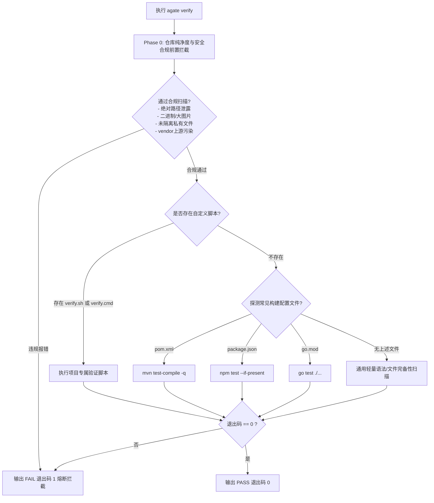

# Agate (Agent Gate) 系统架构与技术设计文档

## 一、 核心问题与设计考量

### 1.1 现实痛点
在实际混合使用 Cursor、Antigravity、Claude Code 等 AI 工具时，主要有三个工程痛点：

- **工具生态分裂**：每款工具各认各的规则路径（`.cursorrules`、`GEMINI.md`、`CLAUDE.md`）。换个环境就得重新教一遍，久而久之各处规则严重漂移。
- **团队代码库被污染**：AI 生成的会话缓存、任务清单（`TASK.md`）和临时文件经常被误提交。直接改团队公共 `.gitignore` 又会把个人偏好强加给同事。
- **代码变动缺乏闭环证据**：AI 经常未经方案确认就大幅覆写代码，改坏后又盲目乱试，甚至提交编译不通过的半成品。

### 1.2 核心防线
针对这些问题，`agate` 确立了三条务实的工程防线：

1. **规约单一事实源**：全局只维护一份核心规范，由工具自动分发到各个编辑器的对应目录，杜绝规则多头维护；
2. **本地隐形隔离**：利用 Git 原生的本地私有机制（`.git/info/exclude`）静默隐藏 AI 专有文件，对团队公共提交树完全透明；
3. **两阶段门禁与自检闭环**：代码改动前必须输出方案等待确认；改动后必须在终端执行自检并拿到绿色的通过物证；同一错误连续两次未过强制熔断交还主控权。


---

## 二、 架构总览与核心分层

```
+-------------------------------------------------------------------------------+
|                             AI Agent 交互层 (LLM Context)                      |
|  - 两阶段硬门禁 (Two-Phase Gate)          - 3-Hop 寻路协议 (AGENTS -> Context) |
|  - 中文原生 & 代码完整性保证               - 两振硬熔断机制 (Two-Strike Failsafe)|
+---------------------------------------+---------------------------------------+
                                        | 规则分发 & 约束对齐
+---------------------------------------v---------------------------------------+
|                      agate 核心分发与适配引擎 (CLI Engine)                    |
|  - 模板自包含引擎 (go:embed)               - 跨平台软链/拷贝自适应 (Symlink Fallback)|
|  - 索引防爆仓生成 (.ignore)               - 目标环境探测 (Adapter Matrix)          |
+---------------------------------------+---------------------------------------+
                                        | 挂载与拦截
+---------------------------------------v---------------------------------------+
|                            本地 Git & 物理文件系统层                          |
|  - 私有跟踪隔离 (.git/info/exclude)        - 提交硬门禁 (.git/custom-hooks)        |
|  - 闭环验证执行器 (agate verify)           - 架构地图资产 (AGENTS.md / contexts)    |
+-------------------------------------------------------------------------------+
```

### 2.1 Agent 交互层
约束 AI 行为的规则引擎，无论用户接入何种 IDE 或模型，均统一注入以下基线：
- **A 级只读诊断**：遇疑问句、报错信息或模糊需求，强制只读分析，严禁调用写操作工具；
- **C 级实施确认**：实施前必须输出精简 Plan，等待用户显式回复“执行”；
- **交付闭环**：修改后自动调起自检命令，获取 `[PASS]` 退出码与物证方可交付。

### 2.2 CLI 核心引擎
采用 Go 编写的单二进制可执行文件：
- **`pkg/adapter`**：统一规约分发器，将内嵌或全局规约映射到 `.gemini/GEMINI.md`、`.cursorrules`、`CLAUDE.md` 等目标文件；
- **`pkg/git`**：Git 仓库探查器，管理 `.git/info/exclude` 与本地 Hook 重定向；
- **`pkg/harness`**：地图骨架生成器、跨平台文件操作与软链回退机制；
- **`internal/templates`**：通过 `go:embed` 将标准规约和配置固化进可执行二进制中，支持脱网离线运行。

### 2.3 底层 Git 与执行层
- **隐形隔离机制**：利用 Git 内置的 `.git/info/exclude` 本地私有忽略文件，避免修改团队共用的 `.gitignore`；
- **独立 Hook 路径**：通过 `git config --local core.hooksPath .git/custom-hooks` 挂载私有 `pre-commit`，不破坏用户全局或其他三方 Hook。

---

## 三、 详细模块设计

### 3.1 目录结构规划
```
agate/
├── cmd/
│   ├── root.go             # 根命令定义、版本信息与全局 Flag
│   ├── init.go             # agate init 命令逻辑
│   ├── verify.go           # agate verify 命令逻辑
│   ├── isolate.go          # agate isolate 隐形隔离逻辑
│   ├── scan.go             # agate scan 拓扑扫描逻辑
│   └── hook.go             # agate hook install / uninstall
├── pkg/
│   ├── adapter/
│   │   ├── adapter.go      # 多 Agent 目标定义与分发接口
│   │   ├── cursor.go       # Cursor 适配器
│   │   ├── gemini.go       # Antigravity/Gemini 适配器
│   │   └── claude.go       # Claude Code 适配器
│   ├── git/
│   │   ├── exclude.go      # .git/info/exclude 读写与去重合并
│   │   └── hook.go         # Git Hooks 安装、激活与卸载
│   └── harness/
│       ├── fs.go           # 跨平台软链、拷贝降级与原子写
│       └── scaffold.go     # AGENTS.md / contexts 骨架初始化
├── internal/
│   └── templates/
│       ├── embed.go        # go:embed 静态资源声明
│       ├── SKILL.md        # 核心 AI 协同规约
│       ├── ignore.tpl      # .ignore 模板
│       └── agents.tpl      # AGENTS.md 初始骨架模板
├── vendor/                 # 离线打包依赖
├── go.mod
├── go.sum
└── main.go
```

### 3.2 跨平台软链与优雅降级算法
在 Windows 环境下，普通用户通常没有 `SeCreateSymbolicLinkPrivilege` 权限。若盲目调用 `os.Symlink` 会抛出 `A required privilege is not held by the client` 错误。

`agate` 采用如下两段式容错机制：
```go
func LinkOrCopy(src, dst string) error {
    // 1. 尝试符号链接 (Linux / macOS / 开启开发者模式的 Windows)
    err := os.Symlink(src, dst)
    if err == nil {
        return nil
    }

    // 2. 捕获权限不足或 Windows 特殊错误，平滑降级为物理文件拷贝
    if runtime.GOOS == "windows" || isPrivilegeError(err) {
        return copyFile(src, dst)
    }

    return err
}
```

### 3.3 验证调度状态机 (`agate verify`)
`agate verify` 为 Agent 提供确定性的交付验收门禁，其执行遵循严格的两阶段防御：



---

## 四、 跨平台与技术选型论证

### 4.1 为什么选择 Go 而非 Node.js (npx) / Python / Shell？

| 考量维度 | Go 单二进制方案 | Node.js (npx) 方案 | Shell 脚本方案 |
| :--- | :--- | :--- | :--- |
| **外部运行时依赖** | **零依赖**。开箱即用，无环境绑架 | 强依赖宿主机已安装 Node.js/npm | 依赖 Bash/PowerShell，语法差异大 |
| **Git Hook 启动耗时** | **< 10ms**，无感知极速拦截 | 200~800ms，每次提交明显卡顿 | 10~50ms，但在 Windows 上极不稳定 |
| **跨平台路径与权限** | 标准库原生抽象抹平 OS 差异 | 需要第三方 npm 模块拼接处理 | Windows 与 Linux 脚本逻辑完全分裂 |
| **分发与更新** | 单文件拷贝、Homebrew、Scoop | `npm install -g` 或 `npx` | 手动下载 `curl | bash`，维护繁琐 |
| **后端/运维无前端场景** | 100% 友好，纯 Java/Go/C++ 项目无负担 | 纯后端服务器需被迫额外安装 Node 运行时 | 勉强支持，但跨系统难以移植 |

结论：对于底层 Git 治理与轻量门禁工具，编译型单二进制（Go）在启动性能、通用性与系统侵入性上具有压倒性优势。

---

## 五、 后续演进路线图 (Roadmap)

### Phase 1: 核心基础（已完成落地）
- [x] CLI 根命令骨架与嵌入式模板（`go:embed`）；
- [x] 多 Agent 规则分发与软链降级拷贝；
- [x] `.git/info/exclude` 自动化去重注入与隔离；
- [x] `agate verify` 自检门禁与本地 `pre-commit` 拦截。

### Phase 2: 动态架构地图与自适应探查
- [x] `agate scan`：自动解析项目 `pom.xml`、`package.json`、`go.mod`、路由配置文件，自动丰富 `AGENTS.md` 端口拓扑；
- [ ] 跨工程全局规约同步机制（支持从 `~/.agate/rules.md` 同步最新规则至当前项目）。

### Phase 3: CI/CD 接入与云端协同
- [ ] GitHub Actions / GitLab CI 门禁插件集成；
- [ ] 规则一致性校验（`agate check --strict`），防止本地规约被手动意外篡改。
