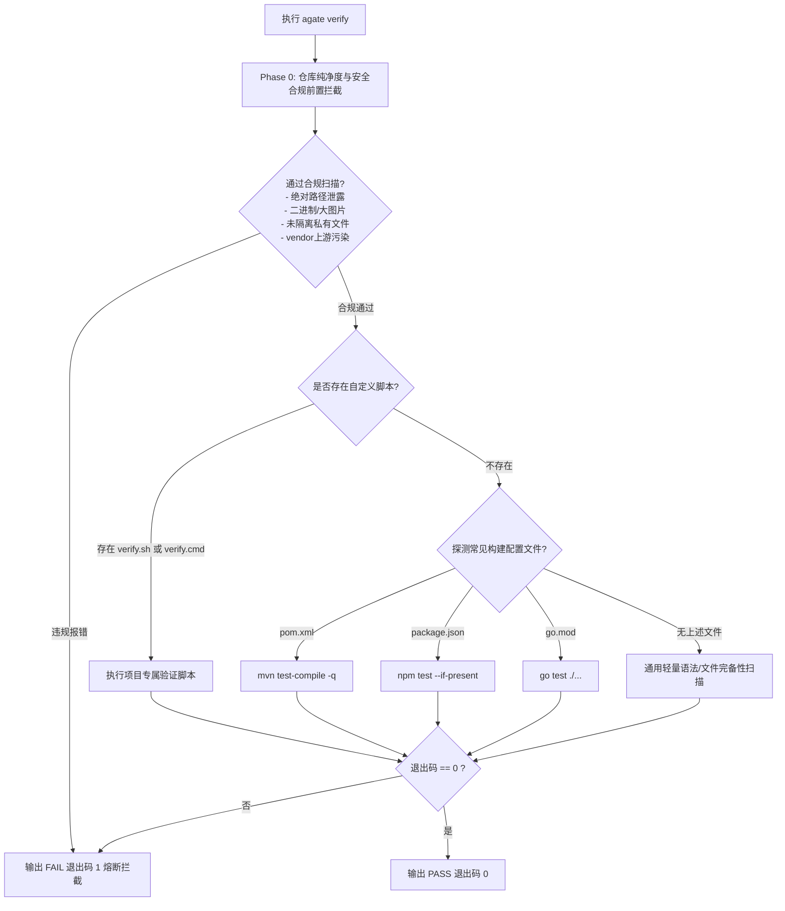

# Agate (Agent Gate) 系统架构与技术设计文档

## 一、 核心问题与设计考量

### 1.1 现实痛点
在实际混合使用 Cursor、Antigravity、Claude Code 等 AI 工具时，主要有三个工程痛点：

- **工具生态分裂**：每款工具各认各的规则路径（`.cursorrules`、`GEMINI.md`、`CLAUDE.md`）。换个环境就得重新教一遍，久而久之各处规则严重漂移。
- **团队代码库被污染**：AI 生成的会话缓存、任务清单（`TASK.md`）和临时文件经常被误提交。直接改团队公共 `.gitignore` 又会把个人偏好强加给同事。
- **代码变动缺乏闭环证据**：AI 经常未经方案确认就大幅覆写代码，改坏后又盲目乱试，甚至提交编译不通过的半成品。

### 1.2 核心防线
针对这些问题，`agate` 确立了三条务实的工程防线：

1. **规约单一事实源**：全局只维护一份核心规范，由工具自动分发到各个编辑器的对应目录，杜绝规则多头维护；
2. **本地隐形隔离**：利用 Git 原生的本地私有机制（`.git/info/exclude`）静默隐藏 AI 专有文件，对团队公共提交树完全透明；
3. **两阶段门禁与自检闭环**：代码改动前必须输出方案等待确认；改动后必须在终端执行自检并拿到绿色的通过物证；同一错误连续两次未过强制熔断交还主控权。


---

## 二、 架构总览与核心分层

```
+-------------------------------------------------------------------------------+
|                             AI Agent 交互层 (LLM Context)                      |
|  - 两阶段硬门禁 (Two-Phase Gate)          - 3-Hop 寻路协议 (MAP -> Context)    |
|  - 中文原生 & 代码完整性保证               - 两振硬熔断机制 (Two-Strike Failsafe)|
+---------------------------------------+---------------------------------------+
                                        | 规则分发 & 约束对齐
+---------------------------------------v---------------------------------------+
|                      agate 核心分发与适配引擎 (CLI Engine)                    |
|  - 模板自包含引擎 (go:embed)               - 跨平台软链/拷贝自适应 (Symlink Fallback)|
|  - 索引防爆仓生成 (.ignore)               - 目标环境探测 (Adapter Matrix)          |
+---------------------------------------+---------------------------------------+
                                        | 挂载与拦截
+---------------------------------------v---------------------------------------+
|                            本地 Git & 物理文件系统层                          |
|  - 私有跟踪隔离 (.git/info/exclude)        - 提交硬门禁 (.git/custom-hooks)        |
|  - 闭环验证执行器 (agate verify)           - 架构地图资产 (MAP.md / contexts)       |
+-------------------------------------------------------------------------------+
```

### 2.1 Agent 交互层
约束 AI 行为的规则引擎，无论用户接入何种 IDE 或模型，均统一注入以下基线：
- **A 级只读诊断**：遇疑问句、报错信息或模糊需求，强制只读分析，严禁调用写操作工具；
- **C 级实施确认**：实施前必须输出精简 Plan，等待用户显式回复“执行”；
- **交付闭环**：修改后自动调起自检命令，获取 `[PASS]` 退出码与物证方可交付。

### 2.2 CLI 核心引擎
采用 Go 编写的单二进制可执行文件：
- **`pkg/adapter`**：统一规约分发器，将内嵌或全局规约映射到 `.gemini/GEMINI.md`、`.cursorrules`、`CLAUDE.md` 等目标文件，支持非破坏性备份与原子写入；
- **`pkg/git`**：Git 仓库探查器，管理 `.git/info/exclude` 受管块、Git Worktree 寻径与本地 Hook 生命周期；
- **`pkg/guard`**：Phase 0 静态合规与安全审计引擎，执行敏感凭据、超大文件、断点残留、绝对路径等 7 大红线拦截，支持暂存区定向审查与大仓库内存忽略查询；
- **`pkg/relay`**：跨 Agent 任务接力与状态机中枢，管理双模 TASK.md、租约互斥锁与接力四要素；
- **`pkg/reporter`**：自包含单文件 HTML 审查报告引擎，汇聚安全审计、Diff 对比、任务看板与物证日志，支持跨平台浏览器自动弹出；
- **`pkg/harness`**：地图骨架生成器、跨平台文件操作、软链回退与真原子写入机制；
- **`internal/templates`**：通过 `go:embed` 将标准规约、地图骨架、任务模板与审查 HTML 模板固化进可执行二进制中，支持脱网离线运行；
- **`pkg/agent`**：多 Agent 环境感知与智能体指纹识别注册中心（Codex, Cursor, Antigravity, Claude, Windsurf）；
- **`pkg/config`**：项目级策略配置中心（`.agate/config.toml`），管理团队级 Agent 目标列表、严格测试模式与命令参数覆盖策略。

### 2.3 底层 Git 与执行层
- **隐形隔离机制**：利用 Git 内置的 `.git/info/exclude` 本地私有忽略文件，采用受管标记块（Managed Block）增量注入，避免修改团队共用的 `.gitignore`；
- **双重物理 Hook 路径**：通过 `git config --local core.hooksPath .git/custom-hooks` 同时挂载私有 `pre-commit`（暂存区定向自检）与 `pre-push`（物理阻断 AI/脚本自动化偷跑推流，锁定提交权 100% 归人类），不破坏用户全局或其他三方 Hook。

---

## 三、 详细模块设计

### 3.1 目录结构规划
```
agate/
├── cmd/
│   ├── root.go             # 根命令定义、版本信息与全局 Flag
│   ├── init.go             # agate init 护栏编排逻辑
│   ├── verify.go           # agate verify 自检引擎 (--staged, --strict, --skip-guard, --report)
│   ├── export.go           # agate export 自包含 HTML 审查报告导出
│   ├── view.go             # agate view 快速浏览器预览审查报告
│   ├── task.go             # agate task 跨 Agent 任务接力 (status/claim/handover/resume/done)
│   ├── isolate.go          # agate isolate 隐形隔离逻辑
│   ├── scan.go             # agate scan 拓扑扫描与确定性回填
│   └── hook.go             # agate hook install / uninstall / status
├── pkg/
│   ├── adapter/
│   │   └── adapter.go      # 多 Agent 目标定义、规约分发与非破坏性备份
│   ├── git/
│   │   ├── exclude.go      # .git/info/exclude 受管块管理、去重与根目录寻径
│   │   ├── hook.go         # Git Hooks 安装、激活、卸载、状态查询与防偷跑
│   │   └── diff.go         # 原生 Git Diff 提取、分支元数据读取
│   ├── guard/
│   │   └── preflight.go    # Phase 0 静态安全红线、敏感信息脱敏与暂存区定向审计
│   ├── relay/
│   │   ├── manifest.go     # TASK.md Frontmatter 双模解析与格式化
│   │   ├── lock.go         # .ai-memory/locks/task.lock 租约互斥锁
│   │   └── relay.go        # 认领、自检交接与唤醒接棒业务编排
│   ├── reporter/
│   │   ├── report.go       # 数据汇聚、HTML 模板编译落盘与历史查找
│   │   └── browser.go      # 跨平台系统浏览器拉起实现 (xdg-open / open / start)
│   └── harness/
│       ├── fs.go           # 跨平台软链、拷贝降级与崩溃安全原子写 (WriteFileAtomic)
│       └── scaffold.go     # MAP.md / contexts / TASK / MEMORY 骨架初始化
├── internal/
│   └── templates/
│       ├── embed.go        # go:embed 静态资源声明
│       ├── review.html.tpl # 自包含 HTML 审查报告模板 (零 CDN 外链依赖)
│       ├── task.tpl        # YAML Frontmatter + 接力四要素任务看板模板
│       ├── SKILL.md        # 核心 AI 协同规约 (SSOT)
│       ├── ignore.tpl      # .ignore 索引防爆仓模板
│       ├── agents.tpl      # MAP.md 初始骨架模板
│       ├── context.tpl     # contexts/context.md 技术契约模板
│       └── memory.tpl      # MEMORY.md 长期记忆模板
├── vendor/                 # 离线打包依赖
├── go.mod
├── go.sum
└── main.go
```

### 3.2 项目配置与 Agent 分发策略

初始化目标采用确定性优先级：显式 `-t` 参数优先，其次读取 `.agate/config.toml` 的 `agent.targets`，再识别当前 Agent 环境，随后探测项目已有 Agent 文件，最后才使用默认目标。这样既支持 Codex 当前终端自动挂载 `AGENTS.md`，也保留用户对多 Agent 项目的显式控制。

项目配置由 `pkg/config` 负责加载和校验。配置模块只暴露解析后的策略对象，命令层负责把策略传给 `pkg/adapter`、Hook 安装和验证调度，避免各模块自行读取 TOML 造成规则漂移。

### 3.3 CI 远程门禁

`.github/workflows/agate.yml` 在 Pull Request 和 `main` 推送事件中执行 `agate ci verify`；GitLab 可使用 `.gitlab-ci.yml`。该入口固定启用严格验证和 HTML 报告。本地 `pre-commit` / `pre-push` 属于开发体验层，远程 CI 才是最终合并裁决层；即使本地使用 `--no-verify` 绕过 Hook，Required status check 仍会阻止未通过的 Pull Request 合并。

### 3.4 可选 Jev 语义决策适配层（规划）

Agate 的核心职责是可复现的确定性门禁：扫描、测试、Hook 与 CI 的结果直接形成允许或阻断。Jev Skills 适合承担另一类问题：当证据完整但结论无法用简单规则描述时，对候选恢复路径、任务交接完整度、Agent 接手建议和审查优先级给出结构化判断。

```text
确定性事实（Guard / Test / Hook / CI）
                ↓
可选 Jev 语义建议（choice / score / needs_review）
                ↓
当前 Agent 或人类确认下一步
```

该适配层必须保持可插拔和默认关闭，避免破坏 Agate 的单二进制、离线可用与零外部运行时依赖特征。Jev 的选择结果不等价于授权：不能放行安全问题、绕过测试、解除 Git Hook，也不能触发提交、推送或合并。API 调用前需用户明确同意，输入必须脱敏并最小化；无法判断、`needs_review` 或 API 失败时只能转人工，不得静默模拟或放行。

### 3.5 跨平台软链与优雅降级算法
在 Windows 环境下，普通用户通常没有 `SeCreateSymbolicLinkPrivilege` 权限。若盲目调用 `os.Symlink` 会抛出 `A required privilege is not held by the client` 错误。

`agate` 采用如下两段式容错机制：
```go
func LinkOrCopy(src, dst string) error {
    // 1. 尝试符号链接 (Linux / macOS / 开启开发者模式的 Windows)
    err := os.Symlink(src, dst)
    if err == nil {
        return nil
    }

    // 2. 捕获权限不足或 Windows 特殊错误，平滑降级为物理文件拷贝
    if runtime.GOOS == "windows" || isPrivilegeError(err) {
        return copyFile(src, dst)
    }

    return err
}
```

### 3.6 验证调度状态机 (`agate verify`)
`agate verify` 为 Agent 提供确定性的交付验收门禁，其执行遵循严格的两阶段防御：



### 3.7 关键工程优化与安全设计

#### 1. 崩溃安全原子写入 (`pkg/harness/fs.go:WriteFileAtomic`)
规约分发或模板更新时，直接调用 `os.WriteFile` 在遇到断电或强杀时容易造成半截文件损坏。Agate 采用标准的崩溃安全原子模式：
- 在目标文件同卷目录下创建临时文件；
- 将内容完全写入后调用 `file.Sync()` 强制将数据刷入物理磁盘介质；
- 调用操作系统原生原子重命名（`os.Rename`）瞬间替换目标文件，确保任何意外场景下原文件完整无损。

#### 2. 大仓库批量内存忽略优化 (`pkg/guard/preflight.go:newGitContext`)
在包含数万未跟踪文件的大型仓库中，对每个文件调用一次 `git check-ignore` 子进程会产生秒级甚至十秒级的进程创建开销。
Agate 在初始化扫描上下文时，单次执行 `git -c core.quotepath=false ls-files --others -i --exclude-standard` 批量读取被忽略路径集合并缓存在内存中；遍历时通过纯内存层级路径前缀判定，将 Git 忽略检测系统调用降为 0，扫描在 10ms 内极速完成。

#### 3. 暂存区精准审查 (`agate verify --staged`)
解决工作区脏代码与实际准备提交内容脱节的痛点：
- 调用 `git diff --cached --name-only --diff-filter=ACMR` 定向获取暂存文件列表；
- 优先通过 `git show :<path>` 直接读取 Git Index 中的暂存内容，而非工作区物理文件；
- 仅当暂存区内容触发安全红线时阻断，未暂存的本地探索性脏代码互不干扰。

### 3.8 跨 Agent 任务接力与状态机设计 (Agate Relay)
为了支持开发者在多款 AI 编程助手（Cursor、Antigravity、Claude Code、Windsurf）之间丝滑接力，Agate 引入了轻量级离线任务中枢：

1. **状态机全生命周期驱动**：
   ```
   [TODO / 空闲]
         │  agate task claim
         ▼
     [CLAIMED]
         │  代码编辑中
         ▼
   [IN_PROGRESS]
         │  agate task handover (强制通过自检并产出 HTML 物证)
         ▼
   [HANDOVER_READY] ──── agate task resume ────► [IN_PROGRESS] (新 Agent 接棒)
         │
         │  agate task done (最终交付，执行全量门禁并解绑互斥锁)
         ▼
      [DONE] (终态归档)
   ```
2. **多 Agent 租约互斥锁 (`pkg/relay/lock.go`)**：
   - 采用 `.ai-memory/locks/task.lock` 软互斥保护，记录持有者 Agent、持有者 PID 与到期时间；
   - 默认 2 小时租约，超时自动释放，杜绝 Agent 异常退出导致的死锁；支持 `--force` 应急强制抢占。
3. **不可篡改流转审计时间线 (Handover Timeline)**：
   - 每次交接在 `TASK.md` 正文末尾自动追加结构化表格行，记录交接时间、From/To、HTML 审查物证与批注；
   - 解析时采用通用非贪婪二级标题截断与 CRLF 归一化，彻底防御 Markdown 表格对“暗坑警示”四要素的污染。

### 3.9 自包含单文件 HTML 审查报告引擎 (Agate Reporter)
用于解决团队异步代码评审、自检物证核验与合规归档：
- **纯原生自包含**：HTML 模板内嵌样式与折叠脚本，零外部 CDN 网络依赖，脱网双击即看；
- **全量汇聚**：聚合展示 Phase 0 7 大安全红线体检、Git 分支与暂存区/工作区 Diff 对比、当前任务状态机与自动化单测控制台日志；
- **跨平台弹出**：`pkg/reporter/browser.go` 原生支持 Windows (`cmd /c start`)、macOS (`open`) 与 Linux (`xdg-open`) 浏览器秒级自动唤起。

### 3.10 两振熔断机制 (Two-Strike Circuit Breaker) 物理实现
为了在物理层彻底杜绝 AI Agent 面对报错盲目猜测、反复死循环改动代码：
- `cmd/verify.go` 在 `.ai-memory/.verify_streak` 中原子维护连续自检失败计数；
- 只要有任意一次自检成功通过，计数器即刻原子重置为 0；
- 当检测到连续自检失败次数 `>= 2` 时，CLI 强行向终端输出醒目红色熔断警示框，提示 Agent 必须停手交还主控权。

---

## 四、 跨平台与技术选型论证

### 4.1 为什么选择 Go 而非 Node.js (npx) / Python / Shell？

| 考量维度 | Go 单二进制方案 | Node.js (npx) 方案 | Shell 脚本方案 |
| :--- | :--- | :--- | :--- |
| **外部运行时依赖** | **零依赖**。开箱即用，无环境绑架 | 强依赖宿主机已安装 Node.js/npm | 依赖 Bash/PowerShell，语法差异大 |
| **Git Hook 启动耗时** | **< 10ms**，无感知极速拦截 | 200~800ms，每次提交明显卡顿 | 10~50ms，但在 Windows 上极不稳定 |
| **跨平台路径与权限** | 标准库原生抽象抹平 OS 差异 | 需要第三方 npm 模块拼接处理 | Windows 与 Linux 脚本逻辑完全分裂 |
| **分发与更新** | 单文件拷贝、Homebrew、Scoop | `npm install -g` 或 `npx` | 手动下载 `curl | bash`，维护繁琐 |
| **后端/运维无前端场景** | 100% 友好，纯 Java/Go/C++ 项目无负担 | 纯后端服务器需被迫额外安装 Node 运行时 | 勉强支持，但跨系统难以移植 |

结论：对于底层 Git 治理与轻量门禁工具，编译型单二进制（Go）在启动性能、通用性与系统侵入性上具有压倒性优势。

---

## 五、 后续演进路线图 (Roadmap)

### Phase 1: 核心基础（已完成落地）
- [x] CLI 根命令骨架与嵌入式模板（`go:embed`）；
- [x] 多 Agent 规则分发与软链降级拷贝；
- [x] `.git/info/exclude` 自动化去重注入与隔离；
- [x] `agate verify` 自检门禁与本地 `pre-commit` 拦截。

### Phase 2: 动态架构地图与多 Agent 接力（已完成落地）
- [x] `agate scan`：自动解析项目 `pom.xml`、`package.json`、`go.mod` 等，自动丰富 `MAP.md` 端口拓扑；
- [x] `agate task`：跨 Agent 协同接力看板、并发租约锁与四要素状态机驱动；
- [x] `agate export` & `agate view`：自包含 HTML 审查物证报告导出与极速预览；
- [x] 两振熔断机制（Two-Strike Circuit Breaker）：物理失败计数器与终端红框拦截；
- [x] 跨平台 CRLF 归一化与防御强化。

### Phase 3: CI/CD 接入与云端发布（部分完成）
- [x] GitHub Actions Goreleaser 跨平台全自动发版流水线；
- [x] 语义化版本自动化发布脚本（`./scripts/bump.sh`）；
- [x] Pull Request 与 `main` 推送的 Agate 严格验证及 HTML 报告 Artifact；
- [ ] 规则一致性校验（`agate check --strict`），防止本地规约被手动意外篡改。

### Phase 4: 可选语义决策辅助（规划）
- [ ] 定义 Jev 适配器接口与本地审查物证格式；
- [ ] 在 `agate task` 中提供交接完整度与接手建议，但不自动流转状态；
- [ ] 在 `agate verify` 中提供失败分流建议，但不改变 PASS/FAIL 结果；
- [ ] 建立脱敏、用户同意与 `needs_review` 人工升级机制。
